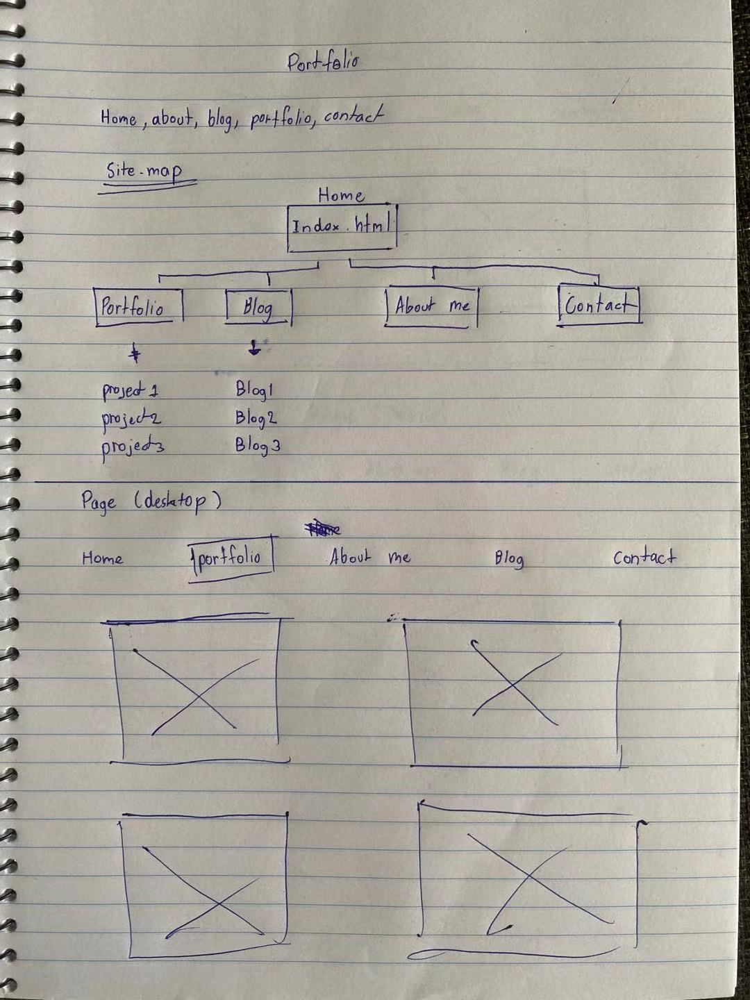
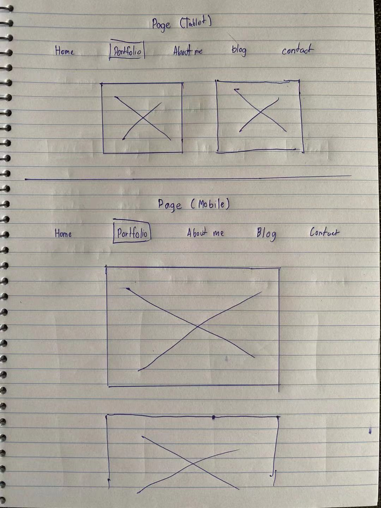
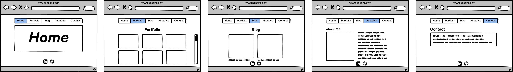
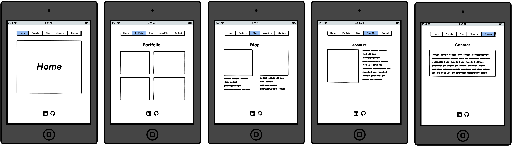
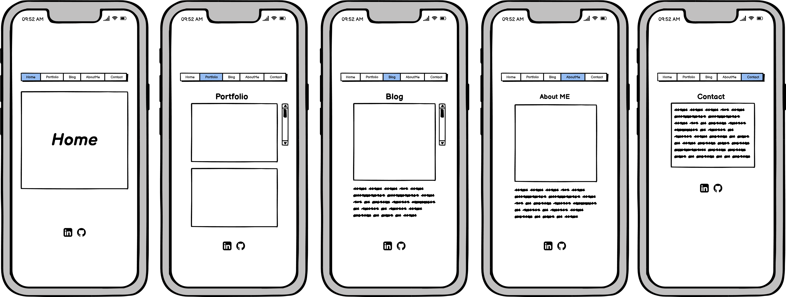
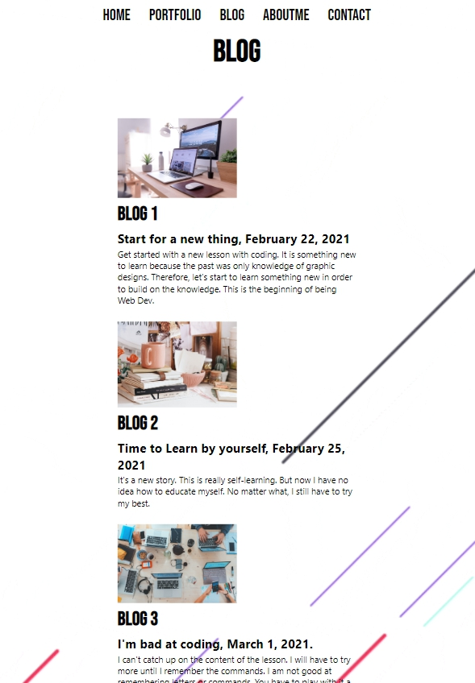
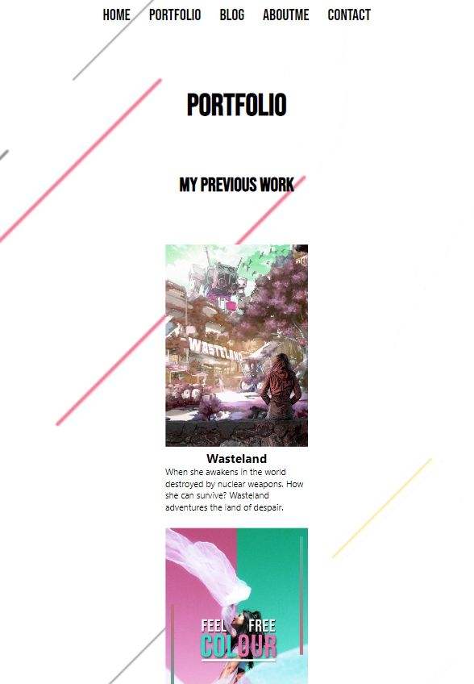
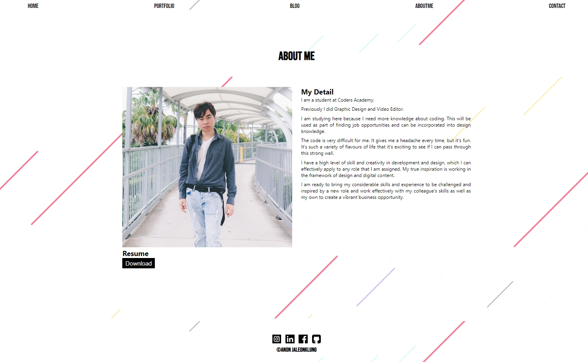

# T1A2 - PORTFOLIO

## Links

[Portfolio](https://anonportfolio.netlify.app/)

[GitHub](https://github.com/anonaeka/T1A2)

## 1.0	Purpose

The purpose of this assignment is to show my ability and skill in using basic HTML and CSS to develop a website. It will be showing a detailed design brief.

The aim is to build my online portfolio. In the target prospective employers with information on my skills, interests, professional knowledge, and previous portfolio performances. By the way, this will be achieved by designing and building a website, which is basically my work.

## 2.0	Functionality/Features

For portfolio websites, it takes a minimalist approach to create a feeling of comfort and accessibility, not overly cluttered. Focus on a classic but modern look. An easy-to-use user interface to reach users of all levels and styles. Responsive design on multiple platforms such as mobile phones or tablets.

Within the structure of the website, there are white spaces and black text for a minimalist look. There is also a feature with animations so that the website does not look too empty. 

By the way, the navigation bar is located at the header of the website:

- Portfolio
- Blog
- About Me
- Contact

Moreover, the social media link bar is placed in the footer section to balance out the website header. Which is part of the content tracking channel on the part of social media. Suitable for people who want to follow my lifestyle.

## 3.0 	Sitemap

This sitemap first conducted by a hand sketch then going to use Balsamiq Wireframes software to create wireframes. There will be very few changes to the final as the social media link and the link for download resumes will be added.

## 3.1 Sketch

## 3.2 Wireframes

- Wireframes were built using Balsamiq Wireframes Software.

### 3.2.1 Desktop

### 3.2.2 Tablet 

### 3.2.3 Mobile

## 4.0	Screenshots

### Home [Desktop]

### Portfolio & Blog [Mobile]

### About Me [Desktop]

## 5.0 	Target audience

The target audience for this portfolio website will be everyone because the website theme requires people to know. It creates a connection for people who are interested in work with me. The website design is designed in a minimalist style for advertising and promote like viral (word of mouth). 

Generally, the most employer has technical knowledge relating to Information Technology such as software development, coding, design and advertising. By making this website a combination of code and website design, it will increase the reach of a wider audience. That is the key part of my determination to make the site look minimal.

## 6.0	Tech Stack

- HTML5

- XHTML

- CSS3

- After Effects

- Photoshop
